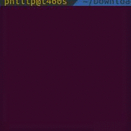

# Sudoku-Solver

This small script can generate 9x9 Sudoku puzzles with varying difficulty. It was created to illustrate all steps in Sudoku solving by using backtracking and depth-first search.

Simply using `python SudokuSolver.py` will start the script with a hard puzzle and show each backtracking step dynamically.

This is a demo of the solver in action:

